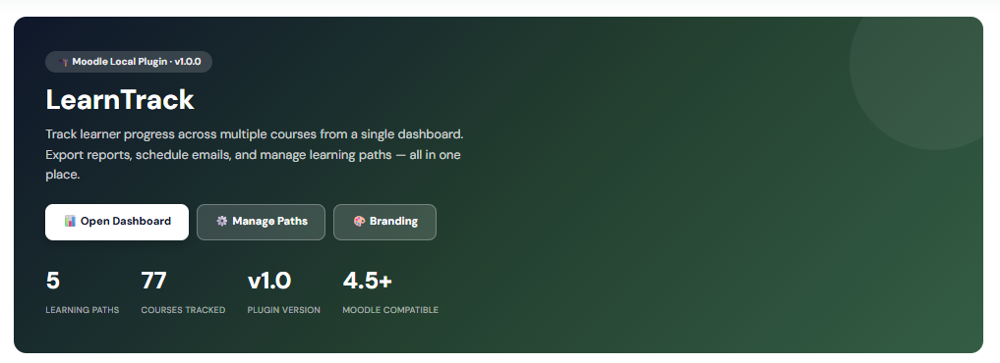
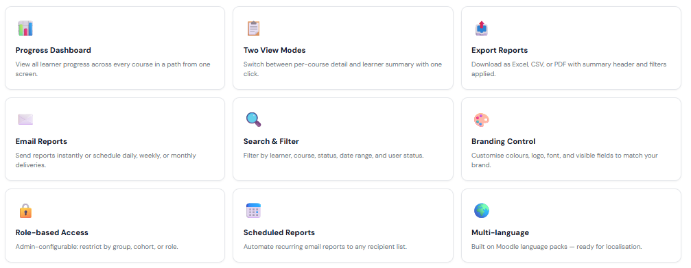
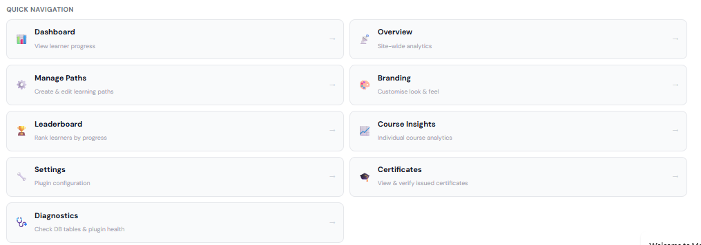
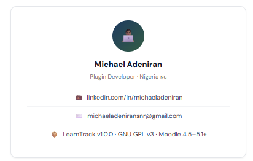

# LearnTrack

**A Moodle plugin suite for tracking learner progress across multiple courses in a learning path — from a single dashboard.**

Developed by [Michael Adeniran](https://www.linkedin.com/in/michaeladeniran) · Nigeria 🇳🇬

This repository contains two Moodle plugins that work together:

| Plugin | Component | What it does |
|---|---|---|
| [`local_learnpath/`](local_learnpath/) | `local_learnpath` | The main plugin — dashboard, reports, reminders, leaderboard, branding, admin tools. See its [full README](local_learnpath/README.md) for details. |
| [`block_learntrack_mypath_v2/`](block_learntrack_mypath_v2/) | `block_learntrack_mypath` | A companion Moodle dashboard block showing learners their assigned paths and progress at a glance. |

---

## Screenshots

**Welcome page**

**Feature overview**

**Quick navigation**

**Developer card**

---

## Getting started

See [`local_learnpath/README.md`](local_learnpath/README.md) for full installation steps, requirements, feature list, and file structure.

## Documentation

- [`local_learnpath/README.md`](local_learnpath/README.md) — full plugin documentation
- [`local_learnpath/CHANGES.md`](local_learnpath/CHANGES.md) — version history
- [`CLAUDE.md`](CLAUDE.md) — detailed log of fixes and changes made during development sessions

## License

Released under the [GNU General Public License v3.0](local_learnpath/LICENSE).
